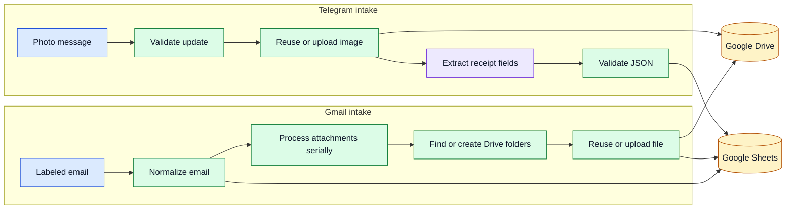

# Document Intake Automation

Two portable n8n workflows for moving incoming documents into a structured,
reviewable system. One handles Gmail attachments. The other handles receipt
images sent to Telegram.

The exports are inactive, use configuration placeholders, and include synthetic
fixtures and deterministic tests.

## Evidence first

| Workflow | Public status | What that means |
|---|---|---|
| Gmail labels to Sheets and Drive | `LIVE_VERIFIED` | Tested twice against an isolated Google sandbox with synthetic messages. The replay created no duplicate rows or files. |
| Telegram receipts to Sheets and Drive | `OFFLINE_VERIFIED`, `NOT_LIVE_TESTED` | Imported successfully and tested with fixtures. No Telegram webhook or Gemini API call was made because those credentials were not available. |

The final Gmail run produced six email-label records, seven attachment records,
seven Drive files, and zero error rows. A second run over the same 48-hour window
left all three counts unchanged. The messages and files were synthetic.

## What it does



Both workflows preserve a clear operational trail in Google Sheets. They use
stable keys for retries, process nested attachment work serially, and keep raw
receipt images even when field extraction fails.

## Important decisions

- Gmail searches are read-only. The workflow does not mark messages as read,
  archive them, or change labels.
- A message with two monitored labels is intentionally handled once per label.
- Sheet writes use stable keys, and Drive uploads use matching private app
  properties, so a rolling time window can be replayed safely.
- Telegram submission time comes from the message timestamp, not text found in
  the image.
- Model output is treated as untrusted JSON. Missing or ambiguous fields become
  `null`; the workflow does not invent values.
- Integration failures become explicit workflow outcomes instead of disappearing
  inside a successful execution.

## Prerequisites

- Node.js 20 or later for the tests
- n8n 2.27.4, or a compatible version you have validated
- Google OAuth credentials for Gmail, Drive, and Sheets
- A Telegram bot and Gemini credential only for the Telegram workflow
- n8n binary storage configured outside process memory for attachment workloads

## Quick start

Run the public test suite before importing anything:

```bash
npm test
```

Then import the inactive exports:

```bash
n8n import:workflow --input="workflows/gmail_multi_label_to_sheets_drive.json"
n8n import:workflow --input="workflows/telegram_receipts_to_sheets_drive.json"
```

After import, confirm both workflows are still inactive. Bind credentials and
replace every `REPLACE_*` value in a private runtime copy.

## View the workflows in n8n

After running the import commands above, use the same local n8n installation and
profile to start the editor:

```bash
n8n start
```

1. Open `http://localhost:5678` in a browser and sign in to your local n8n
   workspace.
2. Open **Overview**, then **Workflows**.
3. Select **Gmail Multi-Label to Sheets and Drive** or
   **Telegram Receipt Photo Processing**.
4. In the editor, use **Zoom to Fit** to see the complete workflow canvas.

Credentials are not required just to inspect the nodes and connections. Keep the
imported workflows inactive: do not publish, execute, or save them while doing a
clean review. Configure and test a separate private copy after binding credentials
and replacing every placeholder.

## Configuration placeholders

The exports contain placeholders for:

- Gmail, Google Sheets, Google Drive, Telegram, and Gemini credentials
- one spreadsheet ID
- three Gmail label IDs
- Gmail and Telegram root Drive folder IDs
- the Gemini model ID

The exact inventory and the required Sheet headers are documented in the workflow
notes and checked by `npm test`. Real credentials and resource IDs do not belong
in these JSON files.

## Verification

The fresh public-export test run on 2026-09-02 passed:

- 687 structural and export checks
- 12 of 12 fixture-driven transformation tests
- compilation of every Code node and n8n expression
- graph reachability, node-version, inactive-state, placeholder, and layout checks
- both renamed public exports imported into an isolated n8n 2.27.4 profile and
  remained inactive

See [TEST_REPORT.md](TEST_REPORT.md) and the sanitized files under
[`evidence/`](evidence/) for the evidence boundary. Import success proves schema
acceptance; it does not prove that an external integration ran.

## Limitations

- Telegram and Gemini were not live-tested in this public package.
- The workflows target n8n 2.27.4 and need compatibility review on other versions.
- The Gmail workflow creates one record per message-label pair, not one record per
  unique message.
- Operators still need retention rules, access controls, and data-processing terms
  appropriate to their jurisdiction.
- No throughput or cost claim is made from the small synthetic verification set.

## Repository map

- `workflows/` - inactive n8n exports
- `fixtures/` - synthetic Gmail, Telegram, and Gemini cases
- `tools/` - deterministic generator, validator, and tests
- `evidence/` - sanitized offline, import, and live-verification summaries

## License

The source is public for review and portfolio evaluation. No reuse license is
granted. See [LICENSE.md](LICENSE.md).
