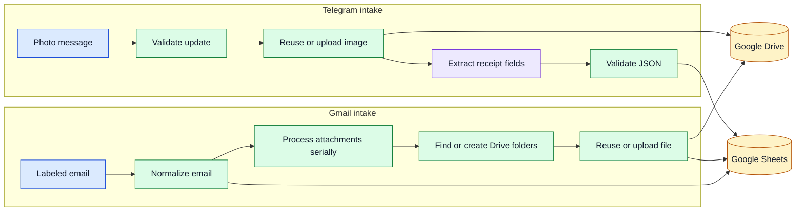

# Document Intake Automation

Two n8n workflows that file incoming documents automatically. Gmail attachments and
Telegram receipt photos land in Google Drive, with a row in Google Sheets for each
one. Re-running them never creates a duplicate.

## Problem

Document intake breaks in the same few places every time. A retry files the same
email twice. An attachment uploads but its spreadsheet row never appears, so the
trail goes quiet. A model reads a blurry receipt and fills the gaps with plausible
guesses. Each of those failures looks like a successful run from the outside.

## Verification status

| Workflow | Status | What that means |
|---|---|---|
| Gmail to Sheets and Drive | Live-verified | I tested it twice against an isolated Google sandbox using synthetic messages. The replay created no duplicate rows or files. |
| Telegram receipts | Offline only | It imports cleanly and passes fixture tests. No Telegram webhook or Gemini call ever ran, because I did not have those credentials. |

The final Gmail run produced:

| Result | Count |
|---|---:|
| Email-label records | 6 |
| Attachment records | 7 |
| Drive files | 7 |
| Error rows | 0 |

A second run over the same 48-hour window left every count unchanged. The messages
and files were synthetic.

## How it works



Both workflows leave a clear trail in Google Sheets. They use stable keys so retries
are safe, process nested attachment work one item at a time, and keep the raw receipt
image even when field extraction fails.

## Key decisions

- Gmail searches are read-only. The workflow never marks messages read, archives
  them, or changes labels.
- A message carrying two monitored labels is handled once per label, on purpose.
- Sheet writes use stable keys and Drive uploads carry matching private app
  properties, so a rolling time window replays safely.
- Telegram submission time comes from the message timestamp, never from text found
  in the image.
- Model output is untrusted JSON. Missing or ambiguous fields become `null`. The
  workflow invents nothing.
- Integration failures surface as explicit workflow outcomes instead of vanishing
  inside a run that reports success.

## Quick start

Run the public test suite before importing anything:

```bash
npm test
```

Then import the inactive exports:

```bash
n8n import:workflow --input="workflows/gmail_multi_label_to_sheets_drive.json"
n8n import:workflow --input="workflows/telegram_receipts_to_sheets_drive.json"
```

After import, confirm both workflows are still inactive. Bind credentials and
replace every `REPLACE_*` value in a private runtime copy.

## View the workflows in n8n

After running the import commands above, use the same local n8n installation and
profile to start the editor:

```bash
n8n start
```

1. Open `http://localhost:5678` in a browser and sign in to your local n8n workspace.
2. Open **Overview**, then **Workflows**.
3. Select **Gmail Multi-Label to Sheets and Drive** or
   **Telegram Receipt Photo Processing**.
4. In the editor, use **Zoom to Fit** to see the complete canvas.

You do not need credentials just to inspect the nodes and connections. Keep the
imported workflows inactive: do not publish, execute, or save them during a clean
review. Configure and test a separate private copy after binding credentials and
replacing every placeholder.

## Configuration placeholders

The exports contain placeholders for:

- Gmail, Google Sheets, Google Drive, Telegram, and Gemini credentials
- one spreadsheet ID
- three Gmail label IDs
- Gmail and Telegram root Drive folder IDs
- the Gemini model ID

The workflow notes document the exact inventory and the required Sheet headers, and
`npm test` checks them. Real credentials and resource IDs do not belong in these JSON
files.

## Scope and limits

The exports ship inactive, use configuration placeholders, and carry synthetic
fixtures.

The public test run on 2026-09-02 passed 687 structural and export checks, 12 of 12
fixture-driven transformation tests, compilation of every Code node and n8n
expression, and graph reachability, node-version, inactive-state, placeholder, and
layout checks. Both renamed exports imported into an isolated n8n 2.27.4 profile and
stayed inactive. See [TEST_REPORT.md](TEST_REPORT.md) and the sanitized files under
[`evidence/`](evidence/).

Import success proves n8n accepts the schema. It does not prove an external
integration ran.

- Telegram and Gemini were never live-tested in this package.
- Built against n8n 2.27.4. Other versions need a compatibility review.
- The Gmail workflow creates one record per message-label pair, not one per unique
  message.
- Operators still need their own retention rules, access controls, and
  data-processing terms.
- The synthetic verification set is too small to support a throughput or cost claim.

## Repository map

- `workflows/` - inactive n8n exports
- `fixtures/` - synthetic Gmail, Telegram, and Gemini cases
- `tools/` - deterministic generator, validator, and tests
- `evidence/` - sanitized offline, import, and live-verification summaries

## License

The source is public for review and portfolio evaluation. No reuse license is
granted. See [LICENSE.md](LICENSE.md).
